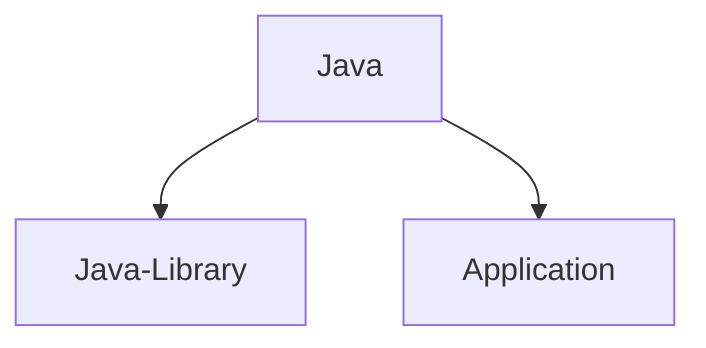

# Gradle Build Tool Overview

Gradle is a powerful build automation tool that simplifies tasks like compiling, testing, publishing, managing dependencies, and handling transitive dependencies with their versions.

---

## Key Concepts in Gradle

### Build Scripts vs. Build Configuration
- **Earlier**: Build scripts were used.
- **Now**: Build configuration is employed for better clarity and efficiency.

### Configuration Files
1. **`build.gradle`**
    - Core file for project configuration.
    - Used to define dependencies, plugins, and tasks.
    - In multi-module projects, the root `build.gradle` often contains shared dependencies and configurations.

2. **`settings.gradle`**
    - Primarily for managing **multi-module projects**.
    - Specifies project structure and module inclusion.

---

## Gradle Philosophy: Convention Over Configuration
- Gradle assumes a **default project structure** for Java source files, resources, tests, etc.
- You can override this structure explicitly in the build configuration.

---

## Modern Practices in Gradle
1. **Kotlin vs. Groovy**
    - Kotlin provides better **IDE support** compared to Groovy for build configurations.

2. **Version Management**
    - Use `libs.versions.toml` to manage dependency versions, ensuring cleaner and more maintainable configurations.

3. **Gradle Wrapper**
    - Ensures **consistent and reproducible builds** across environments.
    - Highly recommended for all Gradle projects.

---

## Creating a New Gradle Project
Run the following commands to initialize a new project:
```bash
mkdir <project-folder> ; cd <project-folder> ; gradle init

```
This will give various options. Choose as per your requirement 

## Notes
The `build.gradle` in root project is normally used for having shared dependencies and configuration .

There are other modern ways so, you may not find the build.gradle in the root project 

## Some important Gradle CLI commands
```bash
./gradlew help
./gradlew tasks // list a subset of the available tasks 
./gradlew tasks --all // list of all available tasks
./gradlew help --task <task>
./gradlew :<project>:<task>
./gradlew clean // remove all build files
./gradlew build // build the application
./gradlew run // run a java application
./gradlew bootRun // run a spring boot application 
```
## Plugins

Plugins can both be applied to settings file aas well as subproject build files 

Plugin can do three things 
- Add new configuration model 
- Initialize configuration 
- Add tasks

For example if we use the following plugin 

```groovy
plugins{
  id("com.gradlelab.upload-test-results")
}
```

We will have a configuration available 
```groovy
testResultsConfig{
   server= "http://..." // server url where the test results are to be uploaded 
}
```
It could be possible that default location could be configured as localhost

Finally, it will add a task 
```bash
./gradlew uploadTestResults
```

## 3 types of Plugins

1. Core - shipped with gradle tool binary . Search Keyword for documentation page - Plugin reference 
2. Community plugin - downloaded from plugin repository such as maven repository 
3. Custom plugin - implemented locally

For community plugin we need to mention the version whereas in core plugin version is picked from binary 

## Important Core Plugins


you can either use Java-Library or Application plugin 

Java plugin is automatically included in both the case 

- Java plugin provides SourceSet configuration for main and test source codes. 

- Java plugin also provides tasks like compileJava and test 

Java-Library Plugin
- adds "api" dependency configuration 
```groovy
plugins {
    id 'java-library'
}

dependencies {
    // Exposes Guava to consumers of this library
    api 'com.google.guava:guava:31.1-jre'

    // Internal to the library, not exposed to consumers
    implementation 'org.apache.commons:commons-lang3:3.12.0'
}
```

## Tasks 

Tasks are basic unit of work in Gradle 
   - Compile 
   - Test
   - Generate Docs

Tasks belong to projects 
   - Different projects can have different tasks 
   - To list all tasks use `./gradlew tasks --all`
      - The tasks with no prefix like model can be run from rootProject folder 

IDE's like intellij have gradle plugins which can be used to run tasks . 

Usually it displays more information compared to cli tools . It shows the prerequisite tasks which should be run before the said task could be run 

To have similar output for command line terminal . 
   - create a `gradle.properties` file in root directory 
   - Add `org.gradle.console=verbose`
   - The output will be similar to following
```bash
$ ./gradlew :app:test
> Task :app:compileJava UP-TO-DATE
> Task :app:processResources NO-SOURCE
> Task :app:classes UP-TO-DATE
> Task :app:compileTestJava UP-TO-DATE
> Task :app:processTestResources NO-SOURCE
> Task :app:testClasses UP-TO-DATE
> Task :app:test UP-TO-DATE

BUILD SUCCESSFUL in 1s
3 actionable tasks: 3 up-to-date
```
   - Here UP-TO-DATE means nothing has changed and it has been used from cache
   - After making a change in AppTest.java . The output changes to something like this 
```bash
$ ./gradlew :app:test
> Task :app:compileJava UP-TO-DATE
> Task :app:processResources NO-SOURCE
> Task :app:classes UP-TO-DATE
> Task :app:compileTestJava
> Task :app:processTestResources NO-SOURCE
> Task :app:testClasses
> Task :app:test

BUILD SUCCESSFUL in 2s
3 actionable tasks: 2 executed, 1 up-to-date

```
   - As you can notice  :app:compileTestJava and :app:testClasses and :app:test were executed and not picked from cache, So these are executed successfully . This is a performance feature known as incremental builds .
   - For other outcomes use search keyword `outcomes` in documentation
   - running only `./gradlew test` will run all test tasks in **rootProject and subprojects** 
   - But some tasks run only for root projects. So, it is a good habit to run specific tasks to execute the tasks faster 
   - The properties can be defined in following places in order of precedence
      - command line , set using -D
      - `gradle.properties` in `GRADLE_USER_HOME` directory
      - `gradle.properties` in  project's directory , then its parent project's directory up to build's root directory 
      - `gradle.properties` in Gradle Installation Directory
   - The search keyword for the above properties in documentation is 'gradle properties'

## Command Line Options 

1. --console=plain or --console=verbose  will show dependent tasks executed 
2. -q hides the log messages 
3. --dry-run will show what tasks will happen without executing 

## Task Concepts in gradle

Tasks have Inputs-> Action -> Output 
- Input can be files , configuration properties or output of another task 
- Action is what the task does 
- Outputs are files produced by Action (for example files in build directory)

## How to apply new Plugin 
 - search for Gradle plugin page on google search 
 - search for a plugin 
 - Identify the latest plugin  and click 
 - The plugin page will show the information to use the plugin and will list the tasks and configuration for the plugin 

## Dependency Management 

Dependency can be a module(downloaded from repositories) / common library modules / local File(not recommended) 

Default repository is mavenCentral which is [https://mvnrepository.com/]()

A dependency like  `implementation com.google.guava:guava 30.1.1-jre` consists of 3 parts
- implementation is the configuration . It will be used internally 
- ID com.google.guava:guava . Here  com.google.guava is the group name and guava is library name
- Version 30.1.1-jre

Grouping the dependency based on the requirement like compile , test , runtime help make the task execute faster 

 Run `./gradlew :app:dependencies` or `./gradlew :app:dep` to see more detail for dependencies in build.gradle
```groovy
dependencies {
    // Use JUnit Jupiter for testing.
    testImplementation libs.junit.jupiter

    testRuntimeOnly 'org.junit.platform:junit-platform-launcher'

    // This dependency is used by the application.
    implementation libs.guava
}
```
as following 
```text
> Task :app:dependencies

------------------------------------------------------------
Project ':app'
------------------------------------------------------------

annotationProcessor - Annotation processors and their dependencies for source set 'main'.
No dependencies

compileClasspath - Compile classpath for source set 'main'.
\--- com.google.guava:guava:33.0.0-jre
     +--- com.google.guava:failureaccess:1.0.2
     +--- com.google.guava:listenablefuture:9999.0-empty-to-avoid-conflict-with-guava
     +--- com.google.code.findbugs:jsr305:3.0.2
     +--- org.checkerframework:checker-qual:3.41.0
     +--- com.google.errorprone:error_prone_annotations:2.23.0
     \--- com.google.j2objc:j2objc-annotations:2.8

compileOnly - Compile-only dependencies for the 'main' feature. (n)
No dependencies

default - Configuration for default artifacts. (n)
No dependencies

implementation - Implementation dependencies for the 'main' feature. (n)
\--- com.google.guava:guava:33.0.0-jre (n)

mainSourceElements - List of source directories contained in the Main SourceSet. (n)
No dependencies

runtimeClasspath - Runtime classpath of source set 'main'.
\--- com.google.guava:guava:33.0.0-jre
     +--- com.google.guava:failureaccess:1.0.2
     +--- com.google.guava:listenablefuture:9999.0-empty-to-avoid-conflict-with-guava
     +--- com.google.code.findbugs:jsr305:3.0.2
     +--- org.checkerframework:checker-qual:3.41.0
     \--- com.google.errorprone:error_prone_annotations:2.23.0

runtimeElements - Runtime elements for the 'main' feature. (n)
No dependencies

runtimeOnly - Runtime-only dependencies for the 'main' feature. (n)
No dependencies

testAnnotationProcessor - Annotation processors and their dependencies for source set 'test'.
No dependencies

testCompileClasspath - Compile classpath for source set 'test'.
+--- com.google.guava:guava:33.0.0-jre
|    +--- com.google.guava:failureaccess:1.0.2
|    +--- com.google.guava:listenablefuture:9999.0-empty-to-avoid-conflict-with-guava
|    +--- com.google.code.findbugs:jsr305:3.0.2
|    +--- org.checkerframework:checker-qual:3.41.0
|    +--- com.google.errorprone:error_prone_annotations:2.23.0
|    \--- com.google.j2objc:j2objc-annotations:2.8
\--- org.junit.jupiter:junit-jupiter:5.10.2
     +--- org.junit:junit-bom:5.10.2
     |    +--- org.junit.jupiter:junit-jupiter:5.10.2 (c)
     |    +--- org.junit.jupiter:junit-jupiter-api:5.10.2 (c)
     |    +--- org.junit.jupiter:junit-jupiter-params:5.10.2 (c)
     |    \--- org.junit.platform:junit-platform-commons:1.10.2 (c)
     +--- org.junit.jupiter:junit-jupiter-api:5.10.2
     |    +--- org.junit:junit-bom:5.10.2 (*)
     |    +--- org.opentest4j:opentest4j:1.3.0
     |    +--- org.junit.platform:junit-platform-commons:1.10.2
     |    |    +--- org.junit:junit-bom:5.10.2 (*)
     |    |    \--- org.apiguardian:apiguardian-api:1.1.2
     |    \--- org.apiguardian:apiguardian-api:1.1.2
     \--- org.junit.jupiter:junit-jupiter-params:5.10.2
          +--- org.junit:junit-bom:5.10.2 (*)
          +--- org.junit.jupiter:junit-jupiter-api:5.10.2 (*)
          \--- org.apiguardian:apiguardian-api:1.1.2

testCompileOnly - Compile only dependencies for source set 'test'. (n)
No dependencies

testImplementation - Implementation only dependencies for source set 'test'. (n)
\--- org.junit.jupiter:junit-jupiter:5.10.2 (n)

testRuntimeClasspath - Runtime classpath of source set 'test'.
+--- com.google.guava:guava:33.0.0-jre
|    +--- com.google.guava:failureaccess:1.0.2
|    +--- com.google.guava:listenablefuture:9999.0-empty-to-avoid-conflict-with-guava
|    +--- com.google.code.findbugs:jsr305:3.0.2
|    +--- org.checkerframework:checker-qual:3.41.0
|    \--- com.google.errorprone:error_prone_annotations:2.23.0
+--- org.junit.jupiter:junit-jupiter:5.10.2
|    +--- org.junit:junit-bom:5.10.2
|    |    +--- org.junit.jupiter:junit-jupiter:5.10.2 (c)
|    |    +--- org.junit.jupiter:junit-jupiter-api:5.10.2 (c)
|    |    +--- org.junit.jupiter:junit-jupiter-engine:5.10.2 (c)
|    |    +--- org.junit.jupiter:junit-jupiter-params:5.10.2 (c)
|    |    +--- org.junit.platform:junit-platform-launcher:1.10.2 (c)
|    |    +--- org.junit.platform:junit-platform-commons:1.10.2 (c)
|    |    \--- org.junit.platform:junit-platform-engine:1.10.2 (c)
|    +--- org.junit.jupiter:junit-jupiter-api:5.10.2
|    |    +--- org.junit:junit-bom:5.10.2 (*)
|    |    +--- org.opentest4j:opentest4j:1.3.0
|    |    \--- org.junit.platform:junit-platform-commons:1.10.2
|    |         \--- org.junit:junit-bom:5.10.2 (*)
|    +--- org.junit.jupiter:junit-jupiter-params:5.10.2
|    |    +--- org.junit:junit-bom:5.10.2 (*)
|    |    \--- org.junit.jupiter:junit-jupiter-api:5.10.2 (*)
|    \--- org.junit.jupiter:junit-jupiter-engine:5.10.2
|         +--- org.junit:junit-bom:5.10.2 (*)
|         +--- org.junit.platform:junit-platform-engine:1.10.2
|         |    +--- org.junit:junit-bom:5.10.2 (*)
|         |    +--- org.opentest4j:opentest4j:1.3.0
|         |    \--- org.junit.platform:junit-platform-commons:1.10.2 (*)
|         \--- org.junit.jupiter:junit-jupiter-api:5.10.2 (*)
\--- org.junit.platform:junit-platform-launcher -> 1.10.2
     +--- org.junit:junit-bom:5.10.2 (*)
     \--- org.junit.platform:junit-platform-engine:1.10.2 (*)

testRuntimeOnly - Runtime only dependencies for source set 'test'. (n)
\--- org.junit.platform:junit-platform-launcher (n)

(c) - A dependency constraint, not a dependency. The dependency affected by the constraint occurs elsewhere in the tree.
(*) - Indicates repeated occurrences of a transitive dependency subtree. Gradle expands transitive dependency subtrees only once per project; repeat occurrences only display the root of the subtree, followed by this annotation.

(n) - A dependency or dependency configuration that cannot be resolved.

A web-based, searchable dependency report is available by adding the --scan option.

BUILD SUCCESSFUL in 186ms
1 actionable task: 1 executed
```

You can see some of the dependencies are not mentioned in the build.gradle but still found in the results .

These are transitive dependencies which can be found looking at pom.xml file for the dependency 

## Two type of dependencies 
1. Bucket dependency (explicitly mentioned in the build.gradle)
2. Resolved Dependency (includes the direct and transitive dependencies )
   - Many tasks use resolved dependency configuration as they need all dependencies 

Also,  it is important to read the legend at the bottom of the output

```plaintext
(c) - A dependency constraint, not a dependency. The dependency affected by the constraint occurs elsewhere in the tree.
(*) - Indicates repeated occurrences of a transitive dependency subtree. Gradle expands transitive dependency subtrees only once per project; repeat occurrences only display the root of the subtree, followed by this annotation.
(n) - A dependency or dependency configuration that cannot be resolved.
```
For example
- `testRuntimeOnly - Runtime only dependencies for source set 'test'. (n)` has n means it is a bucket dependency and is not resolved 
- `testRuntimeClasspath - Runtime classpath of source set 'test'.` does not have n next to it , this means it is a resolved dependency

Important:  the dependency task when run on root project does not run on the subprojects, so you always have to mention explicitly the subproject you want details of the dependencies . Also the dependencies task in gradle plugin for Intellij , it can be found under help sub heading 

## Most common dependency configurations
1. testImplementation - required to compile and run tests , e.g.  junit
2. runtimeOnly - required only for runtime . e.g. logging
3. implementation - only used internally
4. api - exposed to other api's as the current project will work as library and not application


In earlier version there was only compile dependency configuration.

Later this was divided in 2 - api and implementation  and compile dependency configuration was removed . 

It is important to understand that the api configuration is to be used when the you want it in compileTime and runTime both.

If the transitive dependencies are not used and they are marked as implementation , it will not be included in the root project compileTime configurations 

`id("com.autonomousapps.dependency-analysis") version "2.7.0"`   plugin can be applied to **root project** to find misconfigured or misused dependencies and will point out the wrong api or implementation configuration for a given dependency

You can read more on [https://plugins.gradle.org/plugin/com.autonomousapps.dependency-analysis]() on how to use this plugin and related tasks . 

## Mentioning the version of a dependency 

1. 2.3 -  2.3 or later 
2. 2.3!! - strictly 2.3 
3. 2.+ - latest 2.+ version (this is performance expensive )
4. 2.7-SNAPSHOT - snapshot version


Dependency version conflict resolution
The latest versions is picked always . 

If the latest version has some functionality removed , we have to explicitly mention the version to be used . 

## Mentioning the version in a centralized location 

libs.versions.toml should be used to mention the version 

```plaintext
[versions]
guava = "33.0.0-jre"
junit-jupiter = "5.10.2"

[libraries]
guava = { module = "com.google.guava:guava", version.ref = "guava" }
junit-jupiter = { module = "org.junit.jupiter:junit-jupiter", version.ref = "junit-jupiter" }
```
 versions and libraries are mentioned in this file 
`implementation libs.guava` This is how we can use the library in build.gradle
`testImplementation libs.junit.jupiter` here junit-jupiter has been used as junit.jupiter . So, the - are converted to . 

In libraries 
`guava = "com.google.guava:guava:33.0.0-jre"` is also supported 

## Using a group of dependencies 

Create [bundles] in the libs.version.toml 
```plaintext
[bundles]
guava-junit = ["guava","junit-jupiter"]
```
and use following in build.gradle

```groovy
    implementation libs.bundles.guava.junit
```
and remove the dependency in the bundle which are mentioned separately

