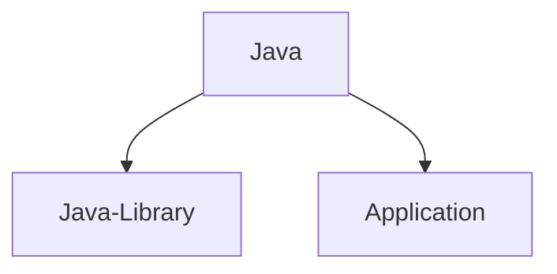

# Gradle Build Tool Overview

Gradle is a powerful build automation tool that simplifies tasks like compiling, testing, publishing, managing dependencies, and handling transitive dependencies with their versions.

---

## Key Concepts in Gradle

### Build Scripts vs. Build Configuration
- **Earlier**: Build scripts were used.
- **Now**: Build configuration is employed for better clarity and efficiency.

### Configuration Files
1. **`build.gradle`**
    - Core file for project configuration.
    - Used to define dependencies, plugins, and tasks.
    - In multi-module projects, the root `build.gradle` often contains shared dependencies and configurations.

2. **`settings.gradle`**
    - Primarily for managing **multi-module projects**.
    - Specifies project structure and module inclusion.

---

## Gradle Philosophy: Convention Over Configuration
- Gradle assumes a **default project structure** for Java source files, resources, tests, etc.
- You can override this structure explicitly in the build configuration.

---

## Modern Practices in Gradle
1. **Kotlin vs. Groovy**
    - Kotlin provides better **IDE support** compared to Groovy for build configurations.

2. **Version Management**
    - Use `libs.versions.toml` to manage dependency versions, ensuring cleaner and more maintainable configurations.

3. **Gradle Wrapper**
    - Ensures **consistent and reproducible builds** across environments.
    - Highly recommended for all Gradle projects.

---

## Creating a New Gradle Project
Run the following commands to initialize a new project:
```bash
mkdir <project-folder> ; cd <project-folder> ; gradle init

```
This will give various options. Choose as per your requirement 

## Notes
The `build.gradle` in root project is normally used for having shared dependencies and configuration .

There are other modern ways so, you may not find the build.gradle in the root project 

## Some important Gradle CLI commands
```bash
./gradlew help
./gradlew tasks // list a subset of the available tasks 
./gradlew tasks --all // list of all available tasks
./gradlew help --task <task>
./gradlew :<project>:<task>
./gradlew clean // remove all build files
./gradlew build // build the application
./gradlew run // run a java application
./gradlew bootRun // run a spring boot application 
```
## Plugins

Plugins can both be applied to settings file aas well as subproject build files 

Plugin can do three things 
- Add new configuration model 
- Initialize configuration 
- Add tasks

For example if we use the following plugin 

```groovy
plugins{
  id("com.gradlelab.upload-test-results")
}
```

We will have a configuration available 
```groovy
testResultsConfig{
   server= "http://..." // server url where the test results are to be uploaded 
}
```
It could be possible that default location could be configured as localhost

Finally, it will add a task 
```bash
./gradlew uploadTestResults
```

## 3 types of Plugins

1. Core - shipped with gradle tool binary . Search Keyword for documentation page - Plugin reference 
2. Community plugin - downloaded from plugin repository such as maven repository 
3. Custom plugin - implemented locally

For community plugin we need to mention the version whereas in core plugin version is picked from binary 

## Important Core Plugins


you can either use Java-Library or Application plugin 

Java plugin is automatically included in both the case 

- Java plugin provides SourceSet configuration for main and test source codes. 

- Java plugin also provides tasks like compileJava and test 

Java-Library Plugin
- adds "api" dependency configuration 
```groovy
plugins {
    id 'java-library'
}

dependencies {
    // Exposes Guava to consumers of this library
    api 'com.google.guava:guava:31.1-jre'

    // Internal to the library, not exposed to consumers
    implementation 'org.apache.commons:commons-lang3:3.12.0'
}
```

## Tasks 

Tasks are basic unit of work in Gradle 
   - Compile 
   - Test
   - Generate Docs

Tasks belong to projects 
   - Different projects can have different tasks 
   - To list all tasks use `./gradlew tasks --all`
      - The tasks with no prefix like model can be run from rootProject folder 

IDE's like intellij have gradle plugins which can be used to run tasks . 

Usually it displays more information compared to cli tools . It shows the prerequisite tasks which should be run before the said task could be run 

To have similar output for command line terminal . 
   - create a `gradle.properties` file in root directory 
   - Add `org.gradle.console=verbose`
   - The output will be similar to following
```bash
$ ./gradlew :app:test
> Task :app:compileJava UP-TO-DATE
> Task :app:processResources NO-SOURCE
> Task :app:classes UP-TO-DATE
> Task :app:compileTestJava UP-TO-DATE
> Task :app:processTestResources NO-SOURCE
> Task :app:testClasses UP-TO-DATE
> Task :app:test UP-TO-DATE

BUILD SUCCESSFUL in 1s
3 actionable tasks: 3 up-to-date
```
   - Here UP-TO-DATE means nothing has changed and it has been used from cache
   - After making a change in AppTest.java . The output changes to something like this 
```bash
$ ./gradlew :app:test
> Task :app:compileJava UP-TO-DATE
> Task :app:processResources NO-SOURCE
> Task :app:classes UP-TO-DATE
> Task :app:compileTestJava
> Task :app:processTestResources NO-SOURCE
> Task :app:testClasses
> Task :app:test

BUILD SUCCESSFUL in 2s
3 actionable tasks: 2 executed, 1 up-to-date

```
   - As you can notice  :app:compileTestJava and :app:testClasses and :app:test were executed and not picked from cache, So these are executed successfully . This is a performance feature known as incremental builds .
   - For other outcomes use search keyword `outcomes` in documentation
   - running only `./gradlew test` will run all test tasks in **rootProject and subprojects** 
   - But some tasks run only for root projects. So, it is a good habit to run specific tasks to execute the tasks faster 
   - The properties can be defined in following places in order of precedence
      - command line , set using -D
      - `gradle.properties` in `GRADLE_USER_HOME` directory
      - `gradle.properties` in  project's directory , then its parent project's directory up to build's root directory 
      - `gradle.properties` in Gradle Installation Directory
   - The search keyword for the above properties in documentation is 'gradle properties'

## Command Line Options 

1. --console=plain or --console=verbose  will show dependent tasks executed 
2. -q hides the log messages 
3. --dry-run will show what tasks will happen without executing 

## Task Concepts in gradle

Tasks have Inputs-> Action -> Output 
- Input can be files , configuration properties or output of another task 
- Action is what the task does 
- Outputs are files produced by Action (for example files in build directory)

## How to apply new Plugin 
 - search for Gradle plugin page on google search 
 - search for a plugin 
 - Identify the latest plugin  and click 
 - The plugin page will show the information to use the plugin and will list the tasks and configuration for the plugin 

